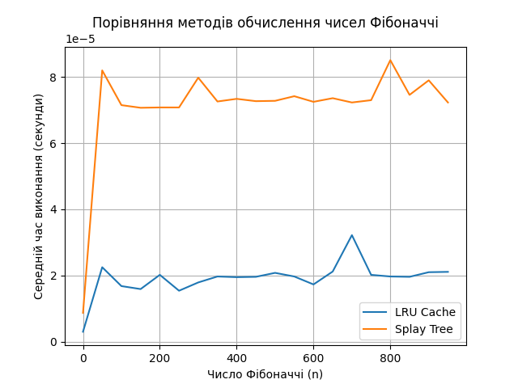

# goit-algo2-hw-07

----

# Завдання  1. Оптимізація доступу до даних за допомогою LRU-кешу

#### Приклад використання
```bash
  python task1.py
```

#### Виведе:
    Час виконання без кешування: 16.03 секунд
    Час виконання з LRU-кешем: 0.18 секунд
### Висновок:
Використання LRU-кешу забезпечує значне прискорення виконання запитів, зменшуючи час обробки запитів майже в 100 разів.

----

# Завдання 2. Порівняння продуктивності обчислення чисел Фібоначчі із використанням LRU-кешу та Splay Tree

#### Приклад використання
```bash
  python task1.py
```

#### Виведе:
| n   | Час LRU Cache (с)          | Час Splay Tree (с)         |
|-----|----------------------------|----------------------------|
| 0   | 3.00002284348011e-06       | 8.700008038431406e-06      |
| 50  | 2.2499996703118086e-05     | 8.19999841041863e-05       |
| 100 | 1.6799953300505877e-05     | 7.149996235966682e-05      |
| 150 | 1.5900004655122757e-05     | 7.070001447573304e-05      |
| 200 | 2.0199979189783335e-05     | 7.080001523718238e-05     |
| 250 | 1.5400000847876072e-05     | 7.080001523718238e-05     |
| 300 | 1.7900019884109497e-05     | 7.98000255599618e-05      |
| 350 | 1.969997538253665e-05      | 7.260002894327044e-05     |
| 400 | 1.9499973859637976e-05     | 7.339997682720423e-05     |
| 450 | 1.9599974621087313e-05     | 7.269997149705887e-05     |
| 500 | 2.0799983758479357e-05     | 7.27999722585082e-05      |
| 550 | 1.969997538253665e-05      | 7.420004112645984e-05     |
| 600 | 1.7300015315413475e-05     | 7.24999699741602e-05      |
| 650 | 2.1200045011937618e-05     | 7.360003655776381e-05     |
| 700 | 3.219995414838195e-05      | 7.229996845126152e-05     |
| 750 | 2.0200037397444248e-05     | 7.299997378140688e-05     |
| 800 | 1.9700033590197563e-05     | 8.509994950145483e-05     |
| 850 | 1.9600032828748226e-05     | 7.459998596459627e-05     |
| 900 | 2.099998528137803e-05      | 7.90000194683671e-05      |
| 950 | 2.1099986042827368e-05     | 7.230002665892243e-05     |


### Висновок:
Використання LRU Cache показало кращу продуктивність для малих значень n, оскільки кешує результати. Splay Tree виявився більш стабільним на більших значеннях, але загалом працював повільніше, ніж LRU Cache.